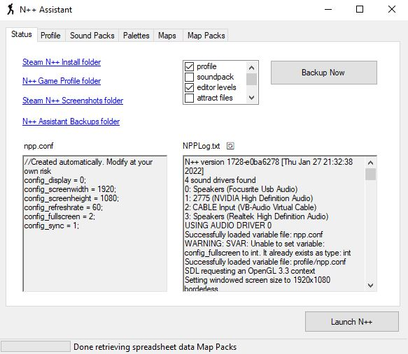
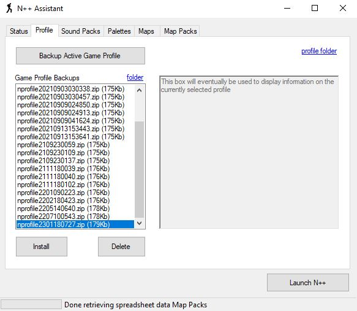
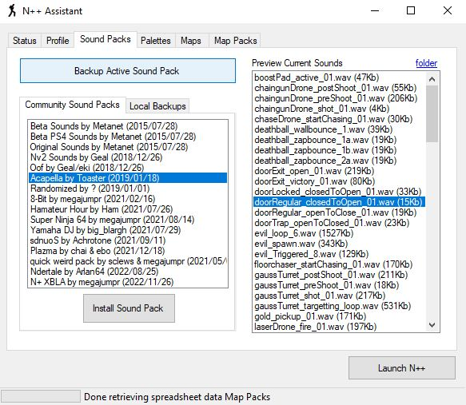
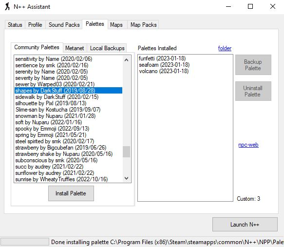
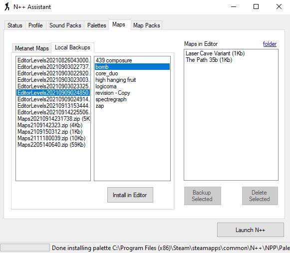
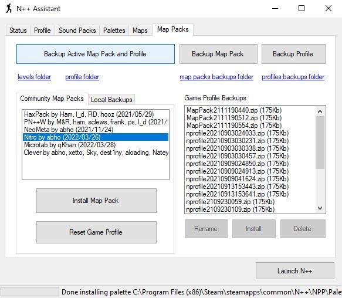

# NPlusPlusAssistant

N++ Assistant helps with backups and installing community mod stuff for the videogame [N++](https://store.steampowered.com/app/230270/N_NPLUSPLUS/). Only for the Steam Windows version.

Needs Visual Studio Community 2019 with C# .Net stuff installed to compile from source.

If you just want to run it, you don't need to compile it from source, just download the zip of the latest version from [releases](https://github.com/psenough/NPlusPlusAssistant/releases), extract that to a folder and launch the .exe inside. First launch might take a little while to see anything happening since the application is creating missing directories and downloading default things from the internet that it'll only need to download once.

## Screenshots

## Stuff it does:

* autodetect main game asset folders and link their explorer folder paths

* backup profile, editor levels, replays, sounds, palettes and game level map packs

* detect if npp is running (avoid install / uninstall while running)

* list all profiles on backup and select one to replace current one or delete

* list metanet palettes (auto download from discord link) and select which to install

* list community palettes (from [google spreadsheet](https://docs.google.com/spreadsheets/d/1I2f87Qhfs6rxzZq5dQRDbLKYyaGLqTdCkLqfNfrw1Mk/edit#gid=0])) and select which to install

* list all palettes on backup and select one to install or delete

* display number of custom palettes installed (and warn of maximum when reached)

* list all soundpacks on backup and select one to install or delete

* list community soundpacks (from [google spreadsheet](https://docs.google.com/spreadsheets/d/18PshamVuDNyH396a7U3YDFQmCw18s4gIVZ_WrFODRd4/edit#gid=0])) and select which to install

* list metanet maps, search by name and select one to put on your map levels editor folder (for practice / remixes)

* list all maps in editor and select which ones to backup or delete

* list all maps in backup and select one to install to your map levels editor folder

* button to launch n++ from within N++ Assistant

* list community map packs (from [google spreadsheet](https://docs.google.com/spreadsheets/d/18PshamVuDNyH396a7U3YDFQmCw18s4gIVZ_WrFODRd4/edit#gid=1470738075])) and select which to install

* list all map packs in backup and select one to install or delete (with optional same timestamp profile)

* backup and patching of npp.dll to support custom leaderboards (supported by Eddy's proxy)

* buttons to fix common display resolution bugs

## Stuff it'll eventually do:

* load from github instead of google spreadsheets (links on google spreadsheets are from discord which is going to start only hosting temporary files)

* detect new official N++ version updates and update the backups accordingly (npp.dll most importantly)

* button to load a new profile with all base levels and colors already unlocked

* list currently install / last installed mods (soundpack, mappack, leaderboard hack) on status tab

* option to refresh lists (in case people are renaming things on folder)

* option to rename backups from within N++ Assistant

* edit nppconf (useful for troubleshooting some launch problems), careful to make sure it's always valid

* better icon

* display nprofile road to 100% completion details / corruption checks on profile tab

* button to relaunch steam in offline/online mode (useful for speedrunning)

* way to inject maps into map packs to facilitate composing map packs

* option to change save/backup directory

* note mentioning metanet palettes aren't listed ingame until you unlock them, even if they are in the Palettes directory, unless you rename them to something else; they are being included as installing options as references for people who want to make their own palettes

* support installing textpacks (like the [VZ pack by megajumpr](https://docs.google.com/spreadsheets/d/18PshamVuDNyH396a7U3YDFQmCw18s4gIVZ_WrFODRd4/edit#gid=1000190067))

* multi-select install metanet palettes

* expose the different spreadsheet url and ids on a default xml (and editable on the GUI) to avoid recompiling the app to alter them

* button to backup all maps in editor (coherence between tabs)

* watchdog to auto-backup your profile everytime it detects n++ closing down

* auto-extract colors from palette and change background/foreground in menu to reflect it (also update on community spreadsheet if possible and using default b/w)

## Known issues:

* `Cross-thread operation not valid:` error when changing to sound packs or map packs tab too quickly right after loading

* rename buttons not working

* some palettes installation don't work because they're not packed cleanly (need to repack, code smarter extractor or create a new column on spreadsheet)

* missing some confirmations on critical stuff that can't be reverted

* missing some checks if npp is running on critical stuff that requires npp to be closed to take effect

* incoherent status message style

* some map level id's are wrong in co-op and race ultimate modes

## Credits:

* main development: ps

* steam directory detection code: yupdaniel

* beta-testing: cloudead, schmole, bigblargh

* other assistance: eddy
